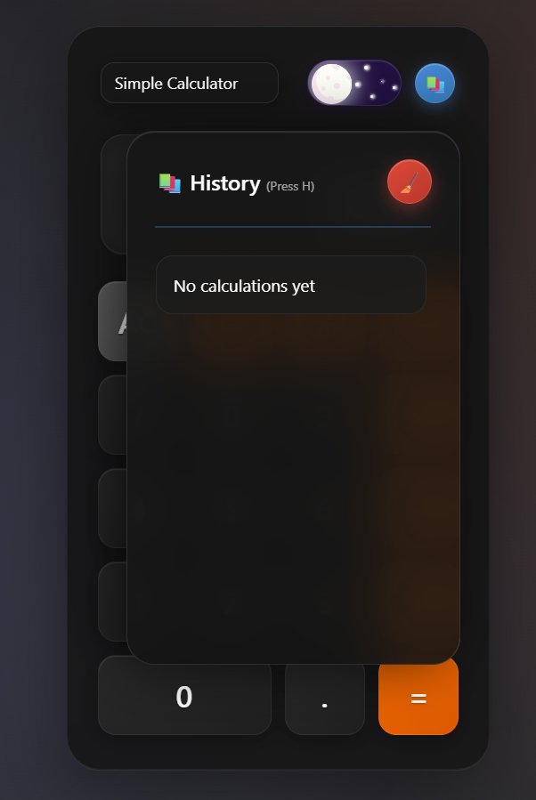
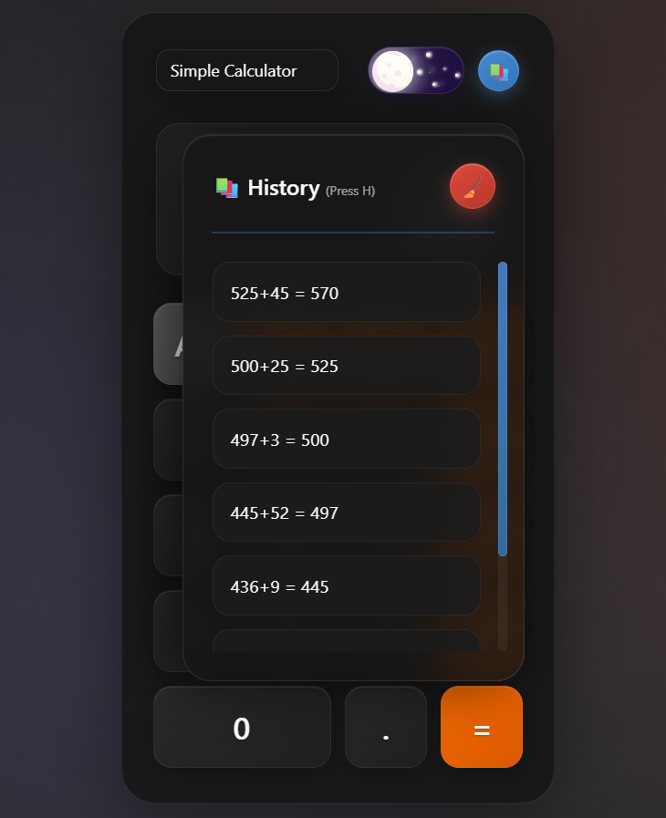

# 🧮 **Calculator**

_A **premium**, **responsive** web calculator with beautiful animations and intuitive controls._  
_Experience seamless calculations with **Dark/Light themes** and **persistent history**._

[](https://grvsnh.github.io/Calculator/)
[](LICENSE)
[](https://github.com/grvsnh)

---

## ✨ **Key Features**

### 🧮 **Core Functionality**

-   ✅ **Basic Operations**: Addition (+), Subtraction (−), Multiplication (×), Division (÷)
-   ✅ **Advanced Functions**: Percentage (%), Backspace, Clear All
-   ✅ **Smart Input**: Prevents invalid operations, handles decimals intelligently
-   ✅ **Error Handling**: Graceful error messages for invalid calculations

### 🎨 **Visual Experience**

-   🌗 **Dual Themes**: Stunning Dark Mode 🌙 and Light Mode ☀️ toggle
-   ✨ **Smooth Animations**: 60fps buttery transitions and micro-interactions
-   🎭 **Beautiful UI**: Glassmorphism design with floating background particles
-   📱 **Fully Responsive**: Perfect on desktop, tablet, and mobile devices

### 📚 **Smart History**

-   📝 **Persistent Storage**: Your calculations saved between sessions
-   🔍 **Interactive History**: Click any previous calculation to reuse
-   🧹 **Easy Management**: One-click clear with visual feedback
-   🎯 **Quick Access**: Slide-out panel with smooth animations

### ⌨️ **Keyboard Support**

-   🎮 **Full Keyboard Control**: Calculate without touching the mouse
-   🚀 **Smart Shortcuts**: Intuitive key mappings for efficiency
-   🎯 **Accessibility**: Screen reader friendly with proper ARIA labels

---

## 📸 **Screenshots**

### 🖥️ **Desktop Experience**

|            🌙 **Dark Mode**            |            ☀️ **Light Mode**             |
| :------------------------------------: | :--------------------------------------: |
|  |  |

### 📚 **History Panel States**

|              📋 **Empty History**               |             📊 **With Calculations**              |
| :---------------------------------------------: | :-----------------------------------------------: |
|  |  |

---

## ⌨️ **Keyboard Shortcuts**

| Key         | Action      | Description                            |
| ----------- | ----------- | -------------------------------------- |
| `0-9`       | Numbers     | Input digits                           |
| `+ - * /`   | Operations  | Basic math operators                   |
| `Enter`     | Calculate   | Execute calculation (same as = button) |
| `Escape`    | Clear/Close | Clear all or close history panel       |
| `Backspace` | Delete      | Remove last character                  |
| `%`         | Percentage  | Convert to percentage                  |
| `.`         | Decimal     | Add decimal point                      |
| `H`         | History     | Toggle history panel                   |

### 🎯 **Pro Tips**

-   Press `H` anytime to quickly access your calculation history
-   Use `Escape` to clear everything or close panels
-   `Enter` works just like clicking the equals button
-   Click anywhere outside the history panel to close it

---

## 🚀 **Live Demo**

**Experience the calculator now:**  
🔗 **[https://grvsnh.github.io/Calculator/](https://grvsnh.github.io/Calculator/)**

---

## 🛠️ **Technical Details**

### **Built With**

-   🎨 **Frontend**: Pure HTML5, CSS3, Vanilla JavaScript
-   ✨ **Styling**: Advanced CSS animations, glassmorphism effects
-   💾 **Storage**: localStorage for persistent history
-   📱 **Design**: Mobile-first responsive approach

### **Performance Features**

-   ⚡ **60fps animations** with optimized CSS transitions
-   🎯 **Efficient DOM manipulation** with minimal reflows
-   💾 **Smart memory management** for history storage
-   📱 **Mobile optimizations** with disabled particles on small screens

---

## 🎮 **How to Use**

### **Basic Calculations**

1. Click numbers and operators or use your keyboard
2. Press `=` or `Enter` to calculate
3. Use `AC` or `Escape` to clear

### **History Management**

1. Click the 📚 button or press `H` to open history
2. Click any previous calculation to reuse its result
3. Use 🧹 button to clear all history
4. Click outside the panel to close

### **Theme Switching**

1. Click the beautiful moon/sun toggle in the top-right
2. Enjoy the smooth transition between themes
3. Your preference is remembered!

---

## 🌟 **Roadmap & Future Plans**

🚀 **Coming Soon:**

-   🧮 **Scientific Calculator** (sin, cos, tan, log, etc.)
-   🏗️ **Engineering Calculator** (unit conversions, constants)
-   💻 **Programmer Calculator** (binary, hex, bit operations)
-   ⚖️ **BMI Calculator** (health & fitness)
-   📊 **Graphing Calculator** (plot functions visually)
-   🎨 **Custom Themes** (create your own color schemes)
-   🔊 **Sound Effects** (optional audio feedback)

---

## 🤝 **Contributing**

We welcome contributions! Here's how you can help:

### **Ways to Contribute**

-   🐛 **Bug Reports**: Found an issue? Let us know!
-   💡 **Feature Requests**: Have ideas? Share them!
-   🔧 **Code Improvements**: Submit a pull request!
-   📝 **Documentation**: Help improve our docs
-   🎨 **UI/UX**: Design improvements welcome

### **Getting Started**

```

# Fork the repository

git clone https://github.com/grvsnh/Calculator.git

# Navigate to project

cd Calculator

# Open in your browser

open index.html

# Start coding! 🎉

```

### **Pull Request Guidelines**

-   Follow existing code style
-   Test your changes thoroughly
-   Update documentation if needed
-   Add meaningful commit messages

---

## 📄 **License**

This project is licensed under the **MIT License** - see the [LICENSE](LICENSE) file for details.

**TL;DR**: You can use, modify, and distribute this freely! 🎉

---

## ⭐ **Show Your Support**

If you found this project helpful:

-   ⭐ **Star this repository**
-   🍴 **Fork it for your own use**
-   📢 **Share with friends**
-   💬 **Leave feedback in issues**

---

## 🙏 **Acknowledgments**

-   🎨 **Design Inspiration**: Modern calculators and glassmorphism trends
-   💡 **Animation Ideas**: CSS animation community
-   🧠 **Math Logic**: Standard calculator algorithms
-   ❤️ **Community**: All contributors and users!

---

## 👥 **Contributors**

Thanks to these amazing people who have contributed to this project:

**Made with [contrib.rocks](https://contrib.rocks)**

### 🏆 **Hall of Fame**

| Contributor                          | Role                        | Contributions                                          |
| ------------------------------------ | --------------------------- | ------------------------------------------------------ |
| [@grvsnh](https://github.com/grvsnh) | 👑 **Creator & Maintainer** | Project architecture, UI/UX design, core functionality |

**Want to see your name here?** Check out our [Contributing Guidelines](CONTRIBUTING.md) and make your first contribution! 🚀

---

**Built with 💻 passion, ☕ coffee, and ✨ creativity**

_"Making calculations beautiful, one click at a time."_

[](https://github.com/grvsnh)
