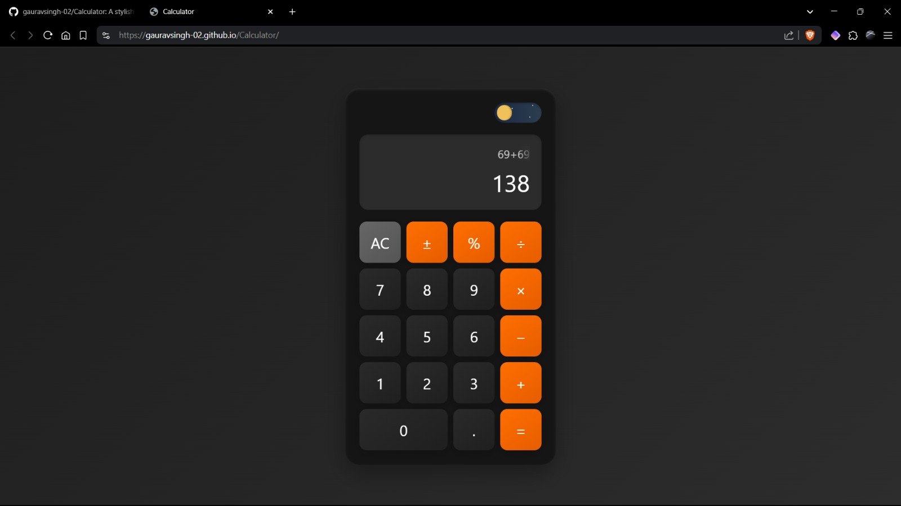
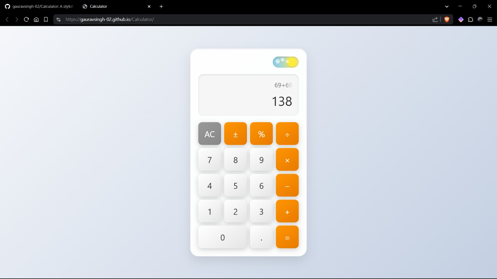
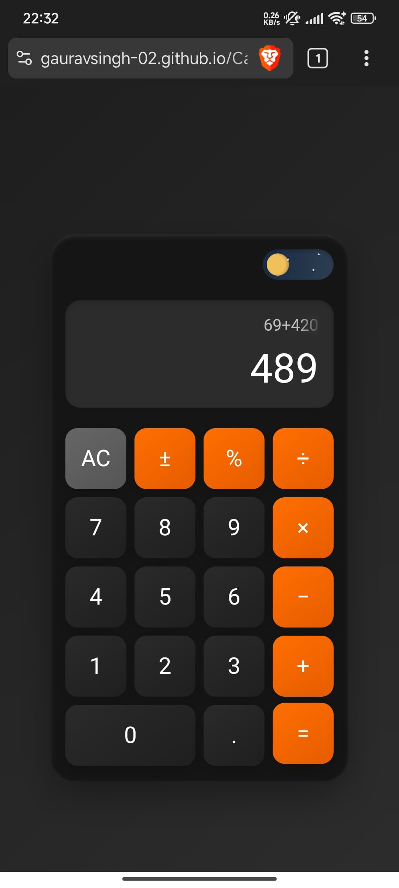
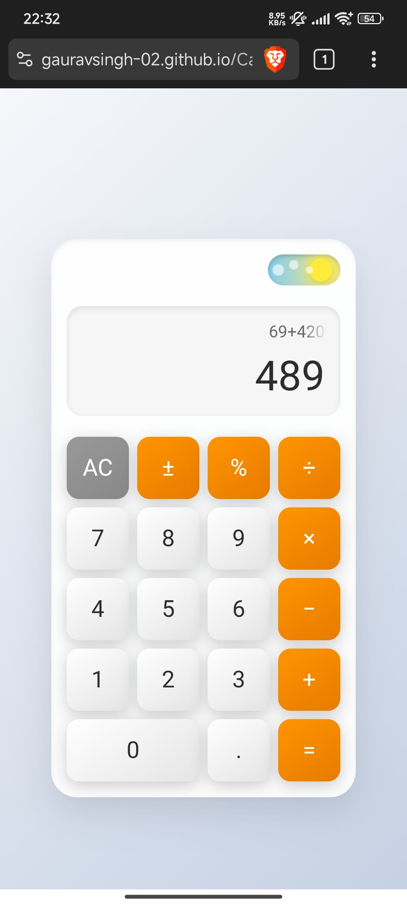

# 🖩 **Calculator**  
*A sleek, minimal, and **responsive** web-based calculator crafted with care.*  
*Supports both **dark** and **light** modes for a seamless experience.*  

---

## ✨ **Features**  
- ✅ **Core Operations**: Addition (+), Subtraction (-), Multiplication (×), Division (÷)  
- 🌗 **Theme Switch**: Toggle between **Light Mode** ☀️ and **Dark Mode** 🌙  
- 📜 **History**: Track your previous calculations with ease  
- 📱 **Responsive Design**: Perfectly adapts to desktop, tablet, and mobile  

---

## 🚀 **Live Demo**  
🔗 [**Click to Try!**](https://gauravsingh-02.github.io/Calculator/)  
*Experience the calculator in action!*  

---

## 📸 **Screenshots**  

### 🖥️ **Desktop View**  
| 🌙 **Dark Mode** | ☀️ **Light Mode** |  
|:-----------------:|:------------------:|  
|  |  |  

### 📱 **Mobile View**  
| 🌙 **Dark Mode** | ☀️ **Light Mode** |  
|:-----------------:|:------------------:|  
|  |  |  

---

## 🌟 **Get Involved**  
- ⭐ *Loving this project? Star the repo!*  
- 📬 *Have ideas or feedback? Open an issue!*  

---

*Built with passion 💻 by [Gaurav Singh](https://github.com/gauravsingh-02).*  
*Powered by creativity and a touch of code magic.*  
