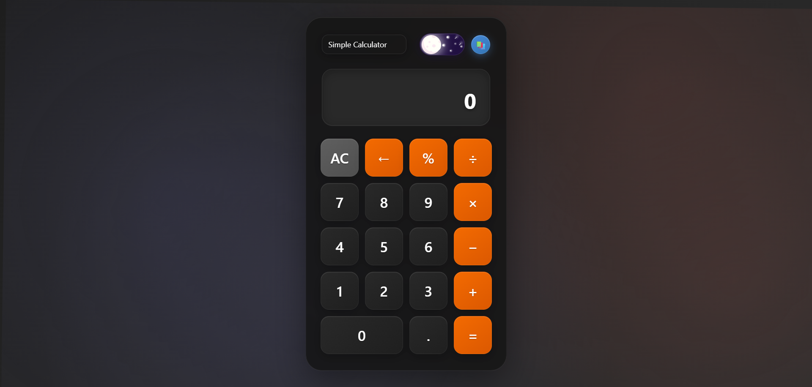
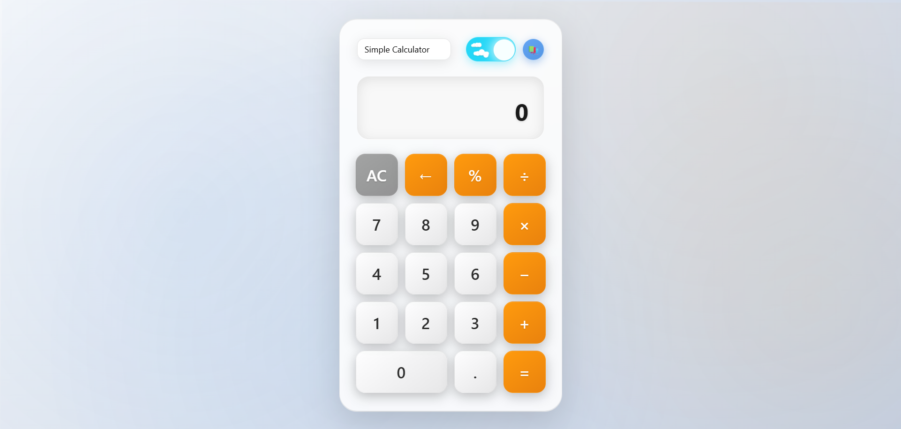
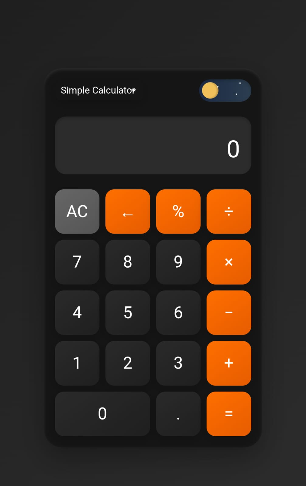
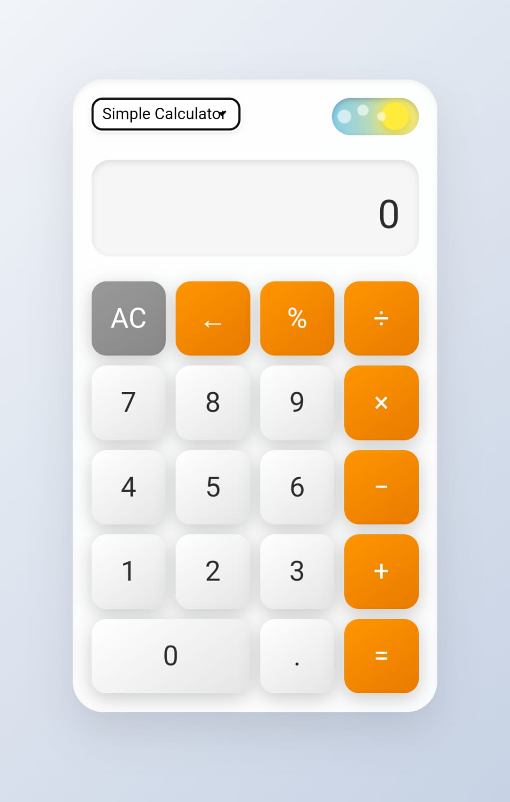

# 🖩 **Calculator**

_A sleek, minimal, and **responsive** web-based calculator crafted with care._  
_Enjoy a seamless experience with **Dark** and **Light** mode support._

---

## ✨ **Features**

-   ✅ **Core Operations**: Addition (+), Subtraction (-), Multiplication (×), Division (÷)
-   🌗 **Theme Switch**: Toggle between **Light Mode** ☀️ and **Dark Mode** 🌙
-   📜 **History**: Keep track of your calculations effortlessly
-   📱 **Responsive Design**: Perfectly adapts to desktop, tablet, and mobile

---

## 🚀 **Live Demo**

🔗 [**Check it out!**](https://grvsnh.github.io/Calculator/)

---

## 📸 **Screenshots**

### 🖥️ **Desktop View**

|                🌙 **Dark Mode**                |                ☀️ **Light Mode**                 |
| :--------------------------------------------: | :----------------------------------------------: |
|  |  |

### 📱 **Mobile View**

|                 🌙 **Dark Mode**                 |                 ☀️ **Light Mode**                 |
| :----------------------------------------------: | :-----------------------------------------------: |
|  |  |

---

## 🌟 **Get Involved**

🚀 **Exciting Future Plans!**  
We're planning to expand this project with **more calculators**, including:

-   🧮 **Scientific Calculator** (trigonometric & logarithmic functions)
-   🏗️ **Engineering Calculator** (unit conversions, advanced equations)
-   ⚖️ **BMI Calculator** (health & fitness tracking)
-   🔢 **Programmer’s Calculator** (binary, hexadecimal, and logic operations)  
    ... and more!

💡 **Want to contribute?**  
We'd love your help in improving and expanding this project!

-   🛠️ **Fork the repo**, make your improvements, and submit a **pull request**!
-   💬 Got ideas? Open an **issue** and let’s discuss.

Your contributions make this project better! 🙌

---

_Built with passion 💻 by [Gaurav Singh](https://github.com/gauravsingh-02)._  
_Licensed under [MIT](LICENSE) – Free to use & modify!_  
_Powered by creativity and a touch of code magic._
